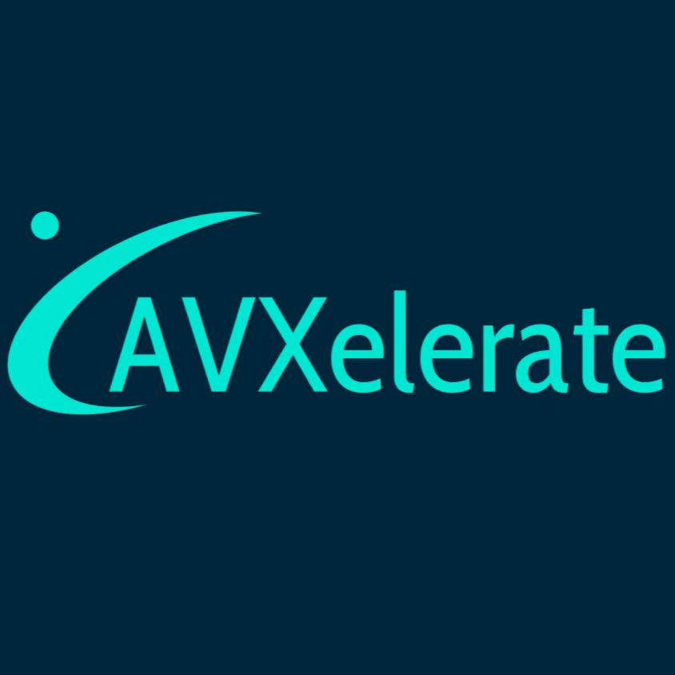

# AVXelerate

AVXelerate is a high-performance mathematical library that optimizes functions such as exp, log, tanh, and sigmoid using the AVX2 instruction set. This project is designed to provide effective acceleration solutions for applications requiring fast mathematical operations, fully utilizing the advanced computational capabilities of AVX2.

<!-- PROJECT SHIELDS -->

[![Contributors][contributors-shield]][contributors-url]
[![Forks][forks-shield]][forks-url]
[![Stargazers][stars-shield]][stars-url]
[![Issues][issues-shield]][issues-url]
[![MIT License][license-shield]][license-url]
[![LinkedIn][linkedin-shield]][linkedin-url]

<!-- PROJECT LOGO -->
 

  

  <h3 align="center">Make exp, log, tanh, and sigmoid Computations More Efficient and Faster!</h3>
  

     Achieve rapid improvement in mathematical operations through AVX2 optimization.
     
    <a href="https://github.com/lerrorgk/AVXelerate"><strong>Explore the docs »</strong></a>
     
     
    <a href="https://github.com/lerrorgk/AVXelerate/">View Demo</a>
    ·
    <a href="https://github.com/lerrorgk/AVXelerate/issues">Report Bug</a>
    ·
    <a href="https://github.com/lerrorgk/AVXelerate/blob/main/README_zh.md">中文</a>
  

 
## Table of Contents

- [Getting Started](#getting-started)
  - [Prerequisites](#prerequisites)
  - [Installation](#installation)
- [Authors](#authors)
- [Acknowledgments](#acknowledgments)

### Getting Started

###### Prerequisites

###### **Installation Steps**

### Authors

lerrorgk

### License

This project is licensed under the MIT License - see the [LICENSE.txt](https://github.com/lerrorgk/AVXelerate/blob/master/LICENSE.txt) file for details

### Acknowledgments

- [Choose an Open Source License](https://choosealicense.com)

<!-- links -->
[your-project-path]:lerrorgk/AVXelerate
[contributors-shield]: https://img.shields.io/github/contributors/lerrorgk/AVXelerate.svg?style=flat-square
[contributors-url]: https://github.com/lerrorgk/AVXelerate/graphs/contributors
[forks-shield]: https://img.shields.io/github/forks/lerrorgk/AVXelerate.svg?style=flat-square
[forks-url]: https://github.com/lerrorgk/AVXelerate/network/members
[stars-shield]: https://img.shields.io/github/stars/lerrorgk/AVXelerate.svg?style=flat-square
[stars-url]: https://github.com/lerrorgk/AVXelerate/stargazers
[issues-shield]: https://img.shields.io/github/issues/lerrorgk/AVXelerate.svg?style=flat-square
[issues-url]: https://img.shields.io/github/issues/lerrorgk/AVXelerate.svg
[license-shield]: https://img.shields.io/github/license/lerrorgk/AVXelerate.svg?style=flat-square
[license-url]: https://github.com/lerrorgk/AVXelerate/blob/main/LICENSE.txt
[linkedin-shield]: https://img.shields.io/badge/-LinkedIn-black.svg?style=flat-square&logo=linkedin&colorB=555
[linkedin-url]: https://www.linkedin.com/in/honglie-li-471455248/
